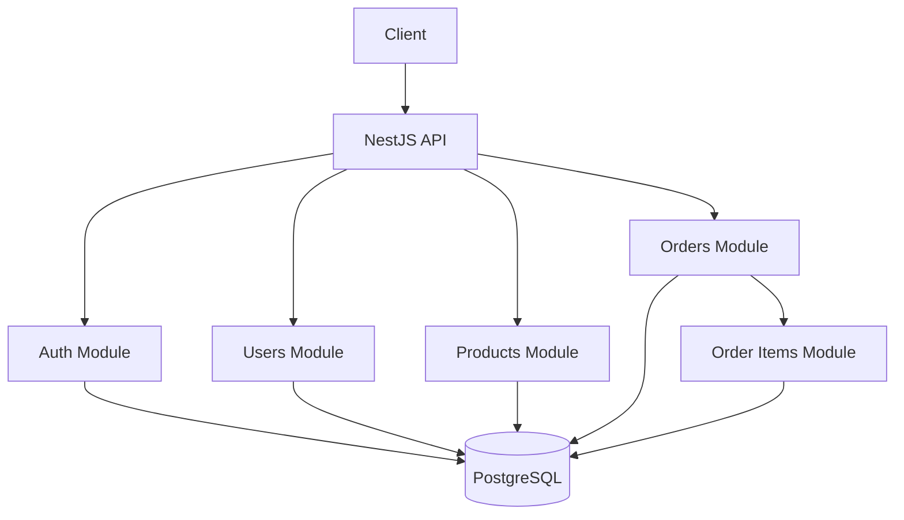
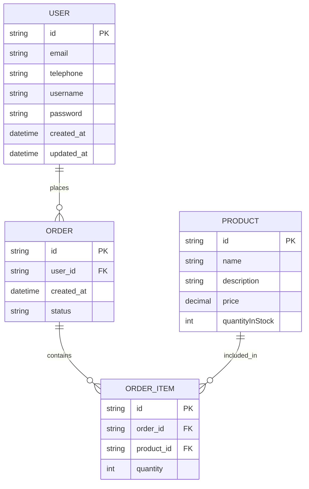
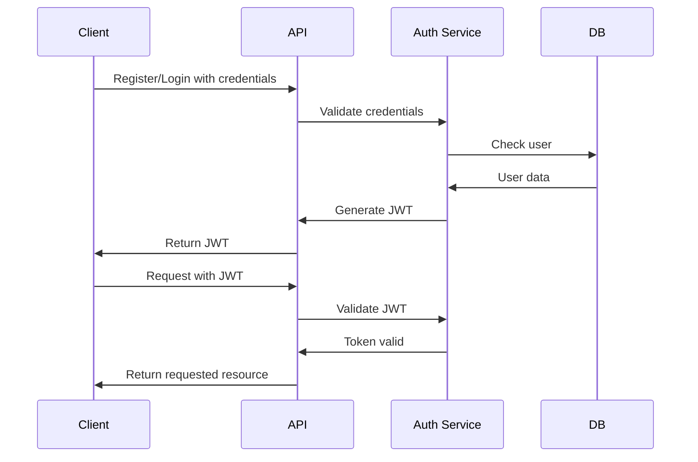
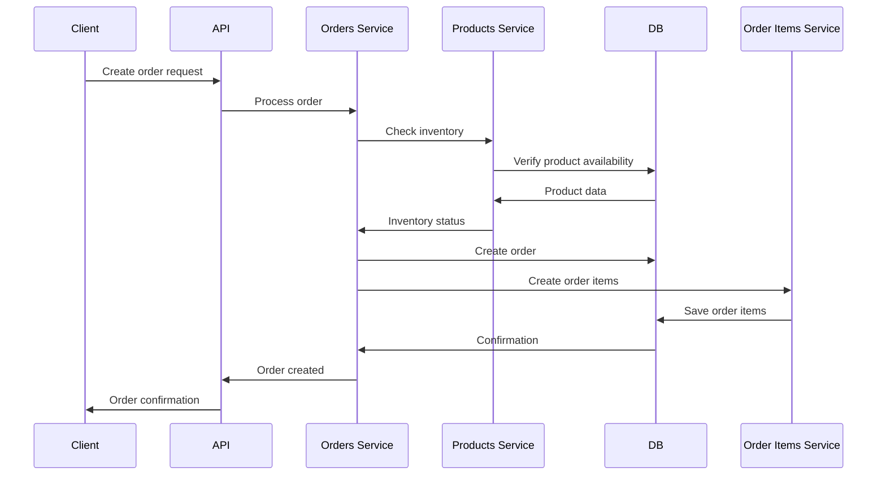

# E-commerce Project Architecture

## System Architecture



## Database Schema



## Module Structure

```
src/
├── auth/
│   ├── auth.controller.ts
│   └── auth.module.ts
├── users/
│   ├── dtos/
│   │   └── create-user.dto.ts
│   ├── entities/
│   │   └── user.entity.ts
│   ├── users.controller.ts
│   └── users.module.ts
├── products/
│   ├── dtos/
│   │   └── create-product.dto.ts
│   ├── entities/
│   │   └── product.entity.ts
│   ├── products.controller.ts
│   └── products.module.ts
├── orders/
│   ├── dtos/
│   │   └── create-order.dto.ts
│   ├── entities/
│   │   └── order.entity.ts
│   ├── order-items/
│   │   ├── dtos/
│   │   │   └── create-order-item.dto.ts
│   │   ├── entities/
│   │   │   └── order-item.entity.ts
│   │   ├── order-items.controller.ts
│   │   └── order-items.module.ts
│   ├── orders.controller.ts
│   └── orders.module.ts
├── app.controller.ts
├── app.module.ts
├── app.service.ts
└── main.ts
```

## Technology Stack

- **Backend Framework**: NestJS (Node.js)
- **Database**: PostgreSQL
- **ORM**: TypeORM
- **Validation**: Zod with @anatine/zod-nestjs
- **Configuration**: @nestjs/config with dotenv
- **Development Tools**: ESLint, Prettier
- **Containerization**: Docker & Docker Compose

## Authentication Flow



## Order Creation Flow

